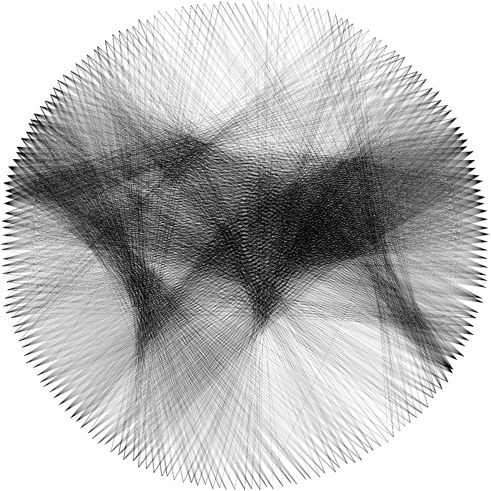

# Circle Thread Art Maker
[](https://opensource.org/licenses/MIT)

## Overview
Circle Thread Art Maker is a graphical application that allows users to create thread art designs from selected images.

## Features
- **Load Images**: Users can load images in various formats including PNG, JPG, JPEG, GIF, BMP, and TIFF.
- **Interactive Canvas**: Users can move two points to determine cutted area

## Usage

1. Run the application script:
   ```bash
   python main.py
   ```
2. Click on "Load Image" to open a file dialog and select an image.
3. Observe the circle drawn based on the selected points.


## Example

### Original Image


### Resulting Thread Art
